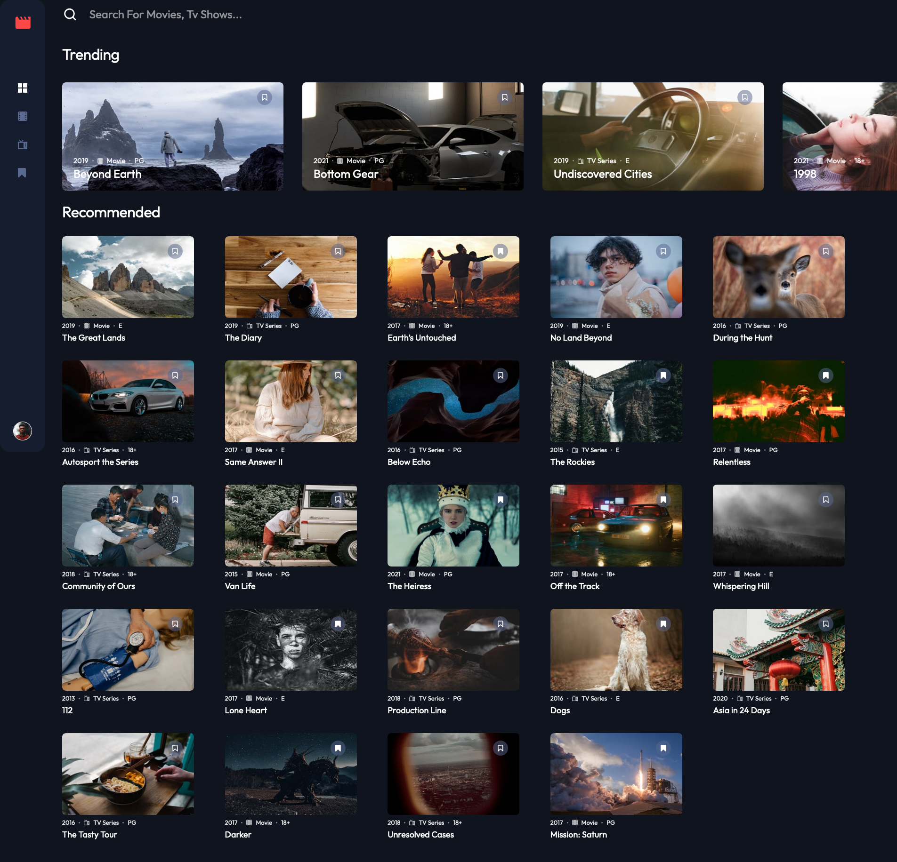
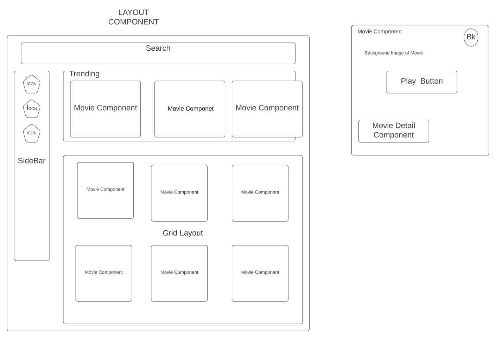

# Frontend Mentor - Entertainment web app solution

This is a solution to the [Entertainment web app challenge on Frontend Mentor](https://www.frontendmentor.io/challenges/entertainment-web-app-J-UhgAW1X). Frontend Mentor challenges help you improve your coding skills by building realistic project.

## Table of contents

- [Overview](#overview)
  - [The challenge](#the-challenge)
  - [Screenshot](#screenshot)
  - [Links](#links)
- [My process](#my-process)
  - [Built with](#built-with)
  - [What I learned](#what-i-learned)
  - [Continued development](#continued-development)
  - [Useful resources](#useful-resources)
- [Author](#author)
- [Acknowledgments](#acknowledgments)

## Overview

### Links

<!-- - Solution URL: [Add solution URL here](https://your-solution-url.com) -->
- Live Site URL: [https://spectacular-scone-be3880.netlify.app/](https://spectacular-scone-be3880.netlify.app/)

### The challenge

Users should be able to:

- View the optimal layout for the app depending on their device's screen size
- See hover states for all interactive elements on the page
- Navigate between Home, Movies, TV Series, and Bookmarked Shows pages
- Add/Remove bookmarks from all movies and TV series
- Search for relevant shows on all pages
- **Bonus**: Build this project as a full-stack application
- **Bonus**: If you're building a full-stack app, we provide authentication screen (sign-up/login) designs if you'd like to create an auth flow

### Screenshot

## My process

### Built with

- Semantic HTML5 markup
- CSS custom properties
- Flexbox
- CSS Grid
- Mobile-first workflow
- [React](https://reactjs.org/) - JS library
- React Router
- Redux
- LucidSpark, Draw.io
- Obsidian

### Docs

- [State Management](./docs/Backend%20Data%20And%20State%20Management.md)
- [HTML Components](./docs/HTML%20CSS.md)
- 

### What I learned

React is really good library to build UI faster, I was able to complete it within 1 week with markup and state management in next week. So total 2 weeks to complete. The main issue I saw is as the codebase gets bigger and more features start to show up, the more libraries you need to install. Even with just 5 extra libraries over React, codebase starts looking bloated, even with good project structure.

In future, 

1. wiil be more deliberate to reduce this bloated codebase
2. wanted to use Django inbetween as backend to do the a fullstack project but more time will be wasted in building a REST API which gives nothing but a json and login. so went with Firebase or any serverless service.
3. The more and more documentation is done well before coding, lets say atleast 60% of `what to do` is decided, the project gets completed within a week. So will be doing some more hypothesis on how much time it takes overall with backend design to complete a project.
4. Making mobile responsive site is pain and will always hate it even if you give me all logic.
5. Will be using UI component libraries like Material UI or Ant to build UI. Anything thats help in building markup faster is good.

### Continued development

1. Position relative and absolute and fixed and sticky, all were used. Fun to play around.
2. Images with more pixels looks good on larger screen. SO using srcset is beneficial.
3. Builidng Backend first and then frontend. Else the context switch can delay project.
4. Client side routing is something needs to be planned from first.
5. Top down planning but bottom up coding??

### Useful resources

- Figma
- CSS tricks
- FullStackOpen Course [https://fullstackopen.com/]

## Author

- Website - [Nikesh Naik](https://nikeshnaik.dev)
- Frontend Mentor - [@nikeshnaik](https://www.frontendmentor.io/profile/nikeshnaik)
- Twitter - [@nikeshinfinity](https://www.twitter.com/nikeshinfinity)

## Acknowledgments

- React Router Documentation
- FullStackOpen Course is fun

